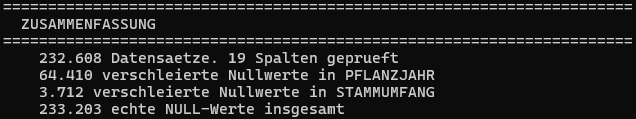
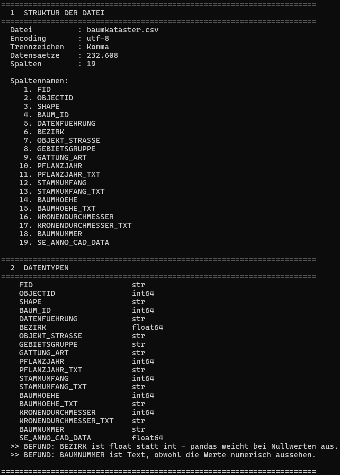
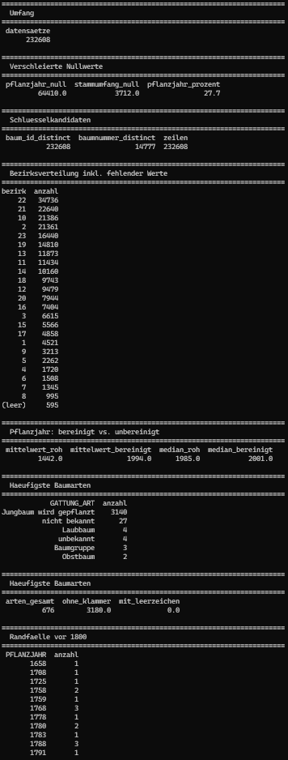
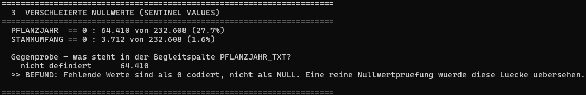
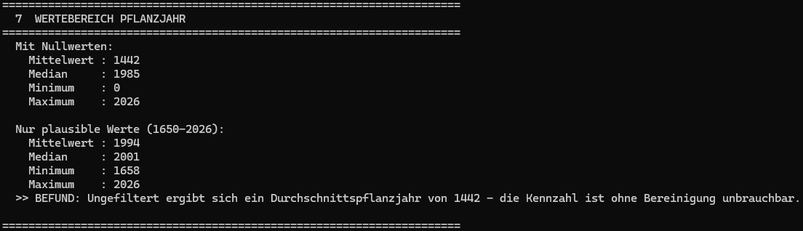
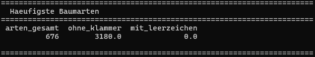
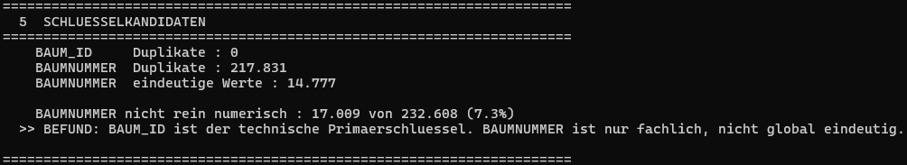
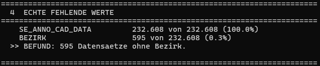
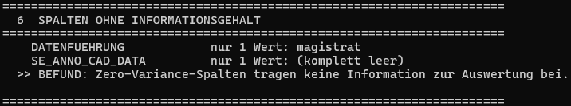
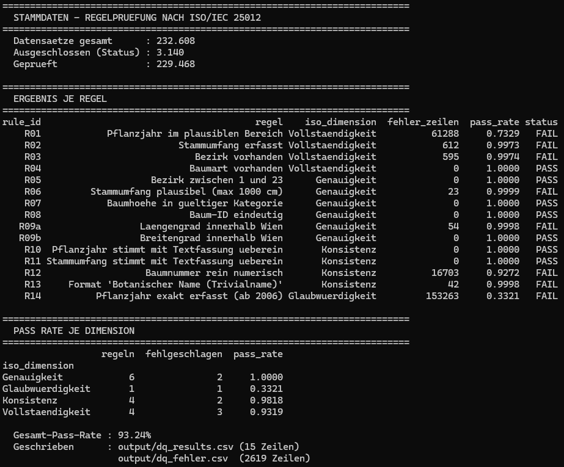

# Stammdaten

<p align="center">
  
</p>

**Data Quality Dashboard für den Wiener Baumkataster, nach ISO/IEC 25012**

Ein Projekt zur systematischen Prüfung von Datenqualität: von der Rohdatei über regelbasierte Validierung bis zum Dashboard, das Qualitätskennzahlen sichtbar und nachvollziehbar macht.

---

## Datenquelle

**Baumkataster bzw. Bäume Standorte Wien**
Magistrat Wien, Magistratsabteilung 42, Wiener Stadtgärten
Bezogen über [data.gv.at](https://www.data.gv.at)

Lizenz: **CC BY 4.0**. Datenquelle: Stadt Wien, data.wien.gv.at

Umfang: 232.608 Datensätze, 19 Spalten. Die Rohdatei ist bewusst nicht Teil dieses Repositorys, sie wird über das Ladeskript bezogen.

---

## Architektur

```
CSV (data.gv.at)
      │
      ▼
  Strukturpruefung   src/01_einlesen.py     pandas
      │
      ▼
  SQL-Analyse        src/02_profiling.py    DuckDB
      │
      ▼
  Regelpruefung      src/03_validierung.py  Great Expectations
      │
      ▼
  Ergebnisdateien    output/*.csv
      │
      ▼
  Dashboard          stammdaten.pbix        Power BI
```

Die beiden Profiling-Schritte sind bewusst getrennt. `01_einlesen.py` prüft mit pandas, ob die Datei korrekt gelesen wird, und wertet die Datentypen aus. `02_profiling.py` bildet dieselben Analysen mengenbasiert in SQL nach. Weichen die Ergebnisse voneinander ab, liegt ein Fehler in einem der beiden Skripte vor. Die Doppelung ist damit eine gegenseitige Kontrolle.

---

## Projektstand

| Schritt | Werkzeug | Status |
|---|---|---|
| Strukturprüfung und Datentypen | pandas | abgeschlossen |
| Inhaltliche Analyse | DuckDB | abgeschlossen |
| Regelprüfung | Great Expectations | abgeschlossen |
| Dashboard | Power BI | offen |

---

## Teil 1: Strukturprüfung mit pandas

Quelle: [`src/01_einlesen.py`](src/01_einlesen.py)

Vor jeder inhaltlichen Analyse muss feststehen, dass die Datei korrekt eingelesen wird. Trennzeichen, Encoding und Datentypen entscheiden darüber, ob ein späterer Befund ein echtes Datenproblem ist oder ein Lesefehler.

<p align="center">
  
</p>

Bereits die Datentypen liefern zwei Hinweise: `BEZIRK` wird als `float64` gelesen, obwohl Bezirksnummern ganze Zahlen sind. pandas weicht auf Fließkomma aus, sobald Nullwerte auftreten. `BAUMNUMMER` wird als Text gelesen, obwohl die Werte numerisch aussehen.

---

## Teil 2: Inhaltliche Analyse mit DuckDB

Quelle: [`src/02_profiling.py`](src/02_profiling.py)

Die Rohdatei wird ohne Zwischenschritt als Tabelle geladen:

```python
con = duckdb.connect()
con.execute(f"""
    CREATE OR REPLACE TABLE baeume AS
    SELECT * FROM read_csv_auto('{PFAD.as_posix()}', header=true)
""")
```

<p align="center">
  
</p>

---

## Befunde

Die Befunde sind nach ihrer Tragweite gruppiert. Screenshots aus Teil 1 zeigen die pandas-Ausgabe, die SQL-Blöcke zeigen die entsprechende Abfrage aus Teil 2.

---

## Kritische Befunde

Diese drei Befunde verfälschen jede Auswertung, die ohne vorgelagerte Prüfung auf den Daten aufsetzt.

### 1. Verschleierte Nullwerte

```sql
SELECT
    SUM(CASE WHEN PFLANZJAHR  = 0 THEN 1 ELSE 0 END) AS pflanzjahr_null,
    SUM(CASE WHEN STAMMUMFANG = 0 THEN 1 ELSE 0 END) AS stammumfang_null
FROM baeume;
```

**64.410 Datensätze (27,7 %) enthalten `PFLANZJAHR = 0`**, weitere 3.712 (1,6 %) enthalten `STAMMUMFANG = 0`.

Beide Spalten sind als Integer typisiert und enthalten formal keine NULL-Werte. Eine reine Nullwertprüfung würde sie daher als vollständig ausweisen. Die Begleitspalte `PFLANZJAHR_TXT` weist dieselben Datensätze korrekt als *nicht definiert* aus. Die textuelle Darstellung dokumentiert die Lücke also ehrlich, während die numerische sie verschleiert.

*Konsequenz für die Regeln:* Vollständigkeit wird nicht über einen NULL-Check geprüft, sondern über einen Plausibilitätsbereich.

<p align="center">
  
</p>

### 2. Verzerrte Kennzahlen als Folge

```sql
SELECT
    ROUND(AVG(PFLANZJAHR), 0) AS mittelwert_roh,
    ROUND(AVG(CASE WHEN PFLANZJAHR BETWEEN 1650 AND 2026
                   THEN PFLANZJAHR END), 0) AS mittelwert_bereinigt,
    MEDIAN(PFLANZJAHR) AS median_roh,
    MEDIAN(CASE WHEN PFLANZJAHR BETWEEN 1650 AND 2026
                THEN PFLANZJAHR END) AS median_bereinigt
FROM baeume;
```

Ungefiltert ergibt sich ein durchschnittliches Pflanzjahr von **1442** bei einem Median von 1985. Nach Ausschluss der Nullwerte liegt der Mittelwert bei **1994**, der Median bei 2001.

Bemerkenswert ist der Unterschied im Verhalten der beiden Kennzahlen: Der Mittelwert bricht um über 550 Jahre ein, während sich der Median nur um 16 Jahre verschiebt. Der Median ist gegenüber Sentinel Values deutlich robuster und eignet sich damit besser für automatisierte Plausibilitätsprüfungen.

<p align="center">
  
</p>

### 3. Vermischte Semantik in GATTUNG_ART

Die Spalte folgt überwiegend dem Format `Botanischer Name (Trivialname)`. Eine Prüfung auf Einhaltung dieses Musters zeigt 3.180 Abweichungen:

```sql
SELECT GATTUNG_ART, COUNT(*) AS anzahl
FROM baeume
WHERE GATTUNG_ART NOT LIKE '%(%'
GROUP BY GATTUNG_ART
ORDER BY anzahl DESC;
```

<p align="center">
  
</p>

Die abweichenden Werte zerfallen in drei Gruppen mit völlig unterschiedlicher Bedeutung:

| Gruppe | Anzahl | Charakter |
|---|---|---|
| Status | 3.140 | Lebenszyklusstatus, keine Artangabe |
| Platzhalter | 31 | zwei Schreibweisen für denselben Sachverhalt |
| Unspezifisch | 9 | gültig, aber auf anderer Detailebene |

Der Wert *Jungbaum wird gepflanzt* ist damit keine fehlende Artangabe, sondern eine Statusinformation, die fachlich in eine eigene Spalte gehört.

Umgekehrt enthalten die regulären Werte bis zu vier Attribute in einem Feld, etwa `Acer platanoides 'Norwegian Sunset' (Spitz-Ahorn)` mit Gattung, Art, Sorte und Trivialname. Beides verstößt gegen die erste Normalform.

*Konsequenz für die Regeln:* Datensätze mit Status *Jungbaum wird gepflanzt* werden vor der Prüfung ausgeschlossen, da fehlende Messwerte dort fachlich korrekt sind. Eine Regel ohne diese Ausnahme erzeugt 3.140 Falschmeldungen.

---

## Strukturelle Befunde

Diese Befunde betreffen das Datenmodell und die Dokumentation, nicht einzelne Werte.

### 4. Technischer und fachlicher Schlüssel

```sql
SELECT
    COUNT(DISTINCT BAUM_ID)    AS baum_id_distinct,
    COUNT(DISTINCT BAUMNUMMER) AS baumnummer_distinct,
    COUNT(*)                   AS zeilen
FROM baeume;
```

`BAUM_ID` ist über alle 232.608 Datensätze eindeutig. `BAUMNUMMER` weist bei nur 14.777 verschiedenen Werten 217.831 Duplikate auf und ist damit kein globaler Schlüssel, sondern ein fachliches Label innerhalb einer Straße oder eines Bezirks.

*Konsequenz für die Regeln:* Eindeutigkeit wird auf `BAUM_ID` geprüft. Eine Prüfung auf `BAUMNUMMER` würde über 200.000 Falschmeldungen erzeugen.

<p align="center">
  
</p>

### 5. Uneinheitliche Formatierung in BAUMNUMMER

17.009 Werte (7,3 %) sind nicht rein numerisch. Das erklärt, warum die Spalte als Text eingelesen wird, obwohl die Mehrzahl der Werte wie Zahlen aussieht.

### 6. Fehlende Bezirkszuordnung

595 Datensätze haben keinen Bezirk. Erkennbar bereits am Datentyp aus Teil 1.

<p align="center">
  
</p>

### 7. Spalten ohne Informationsgehalt

`DATENFUEHRUNG` enthält für alle 232.608 Datensätze denselben Wert. `SE_ANNO_CAD_DATA` ist vollständig leer. Beide tragen nichts zur Auswertung bei.

<p align="center">
  
</p>

### 8. Abweichung zwischen Metadaten und Datenbestand

Die offizielle Attributbeschreibung auf data.gv.at führt die Spalten `BAUM_ID`, `DATENFUEHRUNG`, `SHAPE`, `FID`, `OBJECTID` und `SE_ANNO_CAD_DATA` nicht auf, obwohl sie im Datenbestand vorhanden sind.

### 9. Abweichende Platzhaltertexte

Die Datenbeschreibung gibt an, unbekannte Werte würden in den Text *nicht bekannt* umgewandelt. Tatsächlich enthalten alle 64.410 betroffenen Datensätze den Wert *nicht definiert*. Eine Prüfregel, die sich auf die dokumentierte Schreibweise stützt, würde ins Leere laufen.

*Konsequenz für die Regeln:* Platzhaltertexte werden aus dem Datenbestand abgeleitet, nicht aus der Dokumentation übernommen.

---

## Methodischer Befund

### 10. Auswirkung willkürlicher Schwellenwerte

```sql
SELECT PFLANZJAHR, COUNT(*) AS anzahl
FROM baeume
WHERE PFLANZJAHR BETWEEN 1 AND 1799
GROUP BY PFLANZJAHR
ORDER BY PFLANZJAHR;
```

Die zunächst gewählte Untergrenze von 1800 schloss 18 Datensätze mit Pflanzjahren zwischen 1658 und 1796 aus. Ein Häufungspunkt auf dem Schwellenwert selbst besteht nicht, auf genau 1800 liegt lediglich ein einziger Datensatz. Es handelt sich also nicht um einen weiteren Sentinel Value, sondern um reale Randfälle. Für Wien sind Pflanzjahre im 18. Jahrhundert plausibel, etwa im Augarten oder in Schönbrunn. Die Grenze wurde daraufhin auf 1650 gesenkt.

Der Fall zeigt, dass Prüfregeln selbst eine Fehlerquelle sind: Ein nicht begründeter Schwellenwert erzeugt stille Datenverluste, die in keiner Fehlerstatistik auftauchen.

---

## Teil 3: Regelprüfung mit Great Expectations

Quelle: [`src/03_validierung.py`](src/03_validierung.py)

15 Prüfregeln, jeweils einem inhärenten Datenqualitätsmerkmal nach ISO/IEC 25012 zugeordnet. Ausgeführt auf 229.468 Datensätzen, nach Ausschluss der 3.140 Datensätze mit Status *Jungbaum wird gepflanzt*.

<p align="center">
  
</p>

### Regelkatalog und Ergebnis

| # | Regel | Spalte | Dimension | Fehler | Pass-Rate |
|---|---|---|---|---|---|
| R01 | Pflanzjahr im plausiblen Bereich (1650 bis 2026) | PFLANZJAHR | Vollständigkeit | 61.288 | 73,29 % |
| R02 | Stammumfang erfasst | STAMMUMFANG | Vollständigkeit | 612 | 99,73 % |
| R03 | Bezirk vorhanden | BEZIRK | Vollständigkeit | 595 | 99,74 % |
| R04 | Baumart vorhanden | GATTUNG_ART | Vollständigkeit | 0 | 100 % |
| R05 | Bezirk zwischen 1 und 23 | BEZIRK | Genauigkeit | 0 | 100 % |
| R06 | Stammumfang plausibel (max 1000 cm) | STAMMUMFANG | Genauigkeit | 23 | 99,99 % |
| R07 | Baumhöhe in gültiger Kategorie | BAUMHOEHE | Genauigkeit | 0 | 100 % |
| R08 | Baum-ID eindeutig | BAUM_ID | Genauigkeit | 0 | 100 % |
| R09a | Längengrad innerhalb Wien | SHAPE | Genauigkeit | 54 | 99,98 % |
| R09b | Breitengrad innerhalb Wien | SHAPE | Genauigkeit | 0 | 100 % |
| R10 | Pflanzjahr stimmt mit Textfassung überein | PFLANZJAHR | Konsistenz | 0 | 100 % |
| R11 | Stammumfang stimmt mit Textfassung überein | STAMMUMFANG | Konsistenz | 0 | 100 % |
| R12 | Baumnummer rein numerisch | BAUMNUMMER | Konsistenz | 16.703 | 92,72 % |
| R13 | Format Botanischer Name (Trivialname) | GATTUNG_ART | Konsistenz | 42 | 99,98 % |
| R14 | Pflanzjahr exakt erfasst (ab 2006) | PFLANZJAHR | Glaubwürdigkeit | 153.263 | 33,21 % |

### Bestätigung des Profilings

R01 meldet 61.288 Verstöße bei 229.468 geprüften Datensätzen. Das entspricht exakt den 64.410 Sentinel Values aus Befund 1 abzüglich der 3.140 ausgeschlossenen Jungbäume. Profiling und Regelprüfung stimmen damit überein, was beide Schritte gegenseitig bestätigt.

### 11. Vertauschte Koordinaten oder zu enge Bounding Box

R09a meldet 54 Verstöße, R09b keinen einzigen. Da nur der Längengrad betroffen ist und nicht der Breitengrad, handelt es sich nicht um zufälliges Rauschen. Entweder ist die verwendete Bounding Box am östlichen oder westlichen Rand zu eng geschnitten, oder in einzelnen Datensätzen sind Längen- und Breitengrad vertauscht.

### 12. Unplausible Stammumfänge

R06 meldet 23 Datensätze mit einem Stammumfang über 1000 cm. Ein Baum mit über zehn Metern Stammumfang ist weltweit eine Ausnahmeerscheinung. Wahrscheinlich liegt entweder ein Tippfehler oder eine Erfassung in Millimeter statt Zentimeter vor.

### Zur Bewertung von R14

R14 weist mit 33,21 % die niedrigste Pass-Rate aller Regeln aus, misst aber keine Fehler. Laut Datenbeschreibung der Stadt Wien wurde das Baumalter vor 2006 aus dem Stammumfang geschätzt und ist erst danach exakt erfasst. Die 153.263 Verstöße sind also korrekt erfasste Werte mit geringerer Konfidenz, nicht fehlerhafte Daten.

Die Regel wird deshalb als eigene Kategorie geführt und im Dashboard farblich von echten Verstößen unterschieden. Andernfalls würde eine korrekte Eigenschaft des Datenbestands die Gesamtbewertung verzerren.

### Ergebnisdateien

| Datei | Inhalt |
|---|---|
| `output/dq_results.csv` | eine Zeile je Regel mit Pass-Rate, Fehleranzahl und ISO-Dimension |
| `output/dq_fehler.csv` | eine Zeile je fehlerhaftem Datensatz, verknüpft über `rule_id` |

Die Trennung in zwei Dateien ermöglicht im Dashboard den Drill-through von einer Regel auf die betroffenen Datensätze.

---

## Verwendung

```bash
python -m venv .venv
.\.venv\Scripts\Activate.ps1
pip install -r requirements.txt

python src/01_einlesen.py
python src/02_profiling.py
python src/03_validierung.py
```

Die Rohdatei wird unter `data/raw/baumkataster.csv` erwartet.

---

## Technologie

Python (pandas), DuckDB, Great Expectations, Power BI
